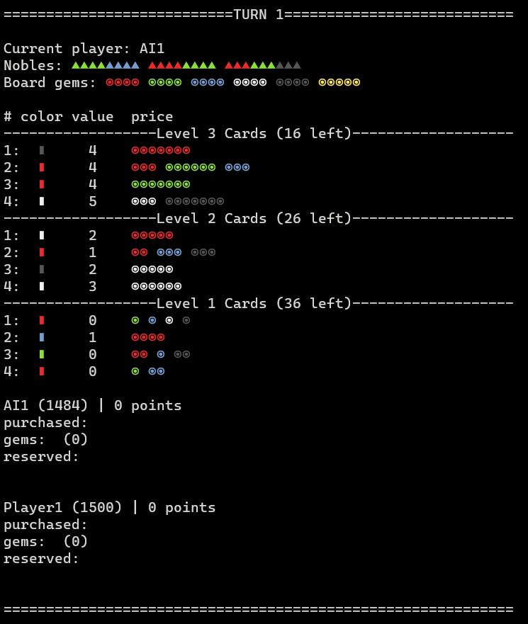

# PySplendor
Splendor board game in command line interface.

## Dependencies
- Works with Python 3.7+
- Termcolor and Colorama external libraries are used for command line coloring

## How to Run
- Download/clone this repository
- Install dependencies with ```pip install -r requirements.txt```
- run [\_\_main\_\_.py](__main__.py) with Python.

## How to Play?
This game is based in Splendor. You can learn the actual rules of the game from [here.](https://www.ultraboardgames.com/splendor/game-rules.php)  
The differences with original game are:  
- Reserved cards aren't hidden.
- You can't choose a noble when there is more than one eligible noble deserved, it's randomly given to you.
- In addition to the 15 point game option, there is also a 21 point game option.

## In Game Screenshot


## Game Actions
Inside this command line game, you can perform 7 different actions: 
* take gems, reserve card, purchase card, purchase hand card, set AI sleep setting, quit, see help.  

Whenever a prompt asks you to type an input, type one of these actions.

**take XXX**: Take a gem
- "X" are chars: 'r','g','b','w','k' (red, green, blue, white, black) which represents colors of gems
- You can enter from 0 to 3 characters after "t"
- Typing only "take" means 'pass'
- **EXAMPLE INPUT**: "take rgb" means take red, green and blue
- **EXAMPLE INPUT**: "take ww" means take two white gems
- **EXAMPLE INPUT**: "take b" means take one blue gem
    
**reserve XY**: Reserve a card
- "X" is digit from 1 to 3
- "Y" is digit from 0 to 3
- **EXAMPLE INPUT**: "reserve 12" means from 1st level, reserve 2nd card 
- **EXAMPLE INPUT**: "reserve 20" means from 2nd level, do a blind reserve
- You **MUST** enter **TWO** digits after "r"
    
**purchase XX**: Purchase a card
- "X" is digit from 1 to 3
- **EXAMPLE INPUT**: "purchase 33" means from 3rd level, purchase 3rd card
- You **MUST** enter **TWO** numbers after "p"
    
**hand X**: Purchase from Hand (from already reserved cards)
- "X" is digits from 1 to 3
- **EXAMPLE INPUT**: "hand 1" means purchase 1st card in your hand (the cards you already reserved)
- You **MUST** enter **ONE** number after "h"

**sleep X**: Set AI sleep time in range of \[0.0, 0.5\] seconds. Default is 0.2 seconds. Without any argument, prints the current setting. Although setting it to 0 seconds not recommended, in order to follow the game, you can use this option for AI vs AI fights.

**quit**: Quit game  
**help**: Show help for each command 

## Features
- A basic one-move-foreseeing AI, which is open for improving.
- Elo scoring system, which you may be familiar from chess, is used for players and account data is stored in Accounts folder.
